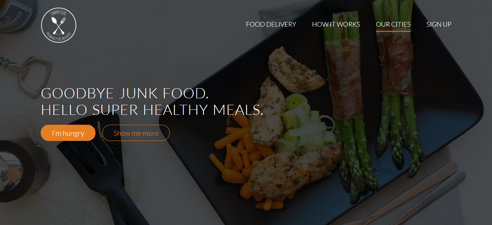

# Omnifood 

## Contents

- [Description](#description)
- [Screenshoots](#screenshoots)
- [Demo Omnifood](#demo-omnifood)

## Description

**Omnifood** is landing page for healthy food deliveries, technologies used is nothing more HTML&CSS and some JQuerie.

## Screenshoots

    
    

## Demo Omnifood

Let's try it.

<!-- # omnifood

**Omnifood** is landing page for healthy food deliveries, technologies used is nothing more HTML&CSS and some JQuerie.

# Screenshot

  
  

 -->
